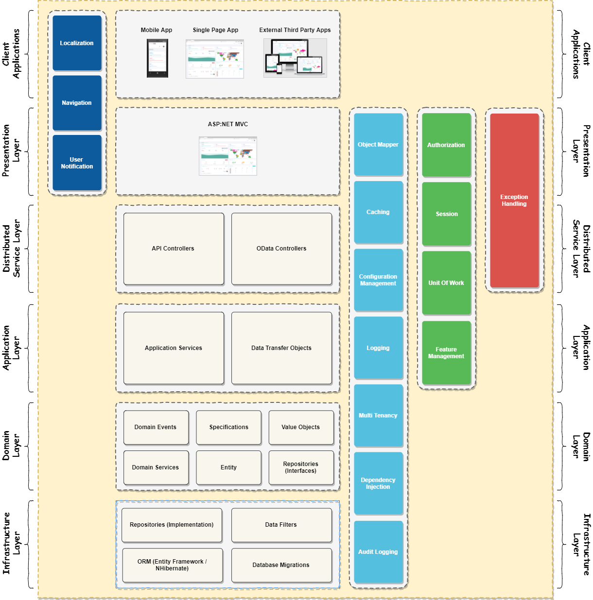

# Introduction

This is a template based on ASP.NET Boilerplate with **.Net Framework** and has **3** different client versions:

1. Angular
2. React
3. Vue

|.Net| Angular|React|Vue|
| :------------: | :------------: | :------------: | :------------: |
|  |  |  |   |

# Architecture

ABP provides a layered architectural model based on Domain Driven Design and provides a SOLID model for your application.

# Code of Conduct
This project has adopted the code of conduct defined by the Contributor Covenant to clarify expected behavior in our community. For more information see the [.NET Foundation Code of Conduct.](https://dotnetfoundation.org/code-of-conduct "NET Foundation Code of Conduct.")

# .NET Foundation
This project is supported by the [.NET Foundation](https://dotnetfoundation.org/ ".NET Foundation")
# License

[MIT](LICENSE).
